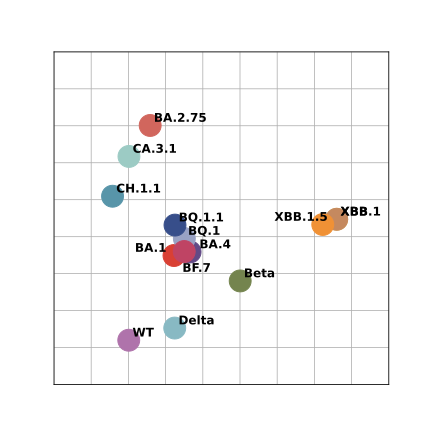
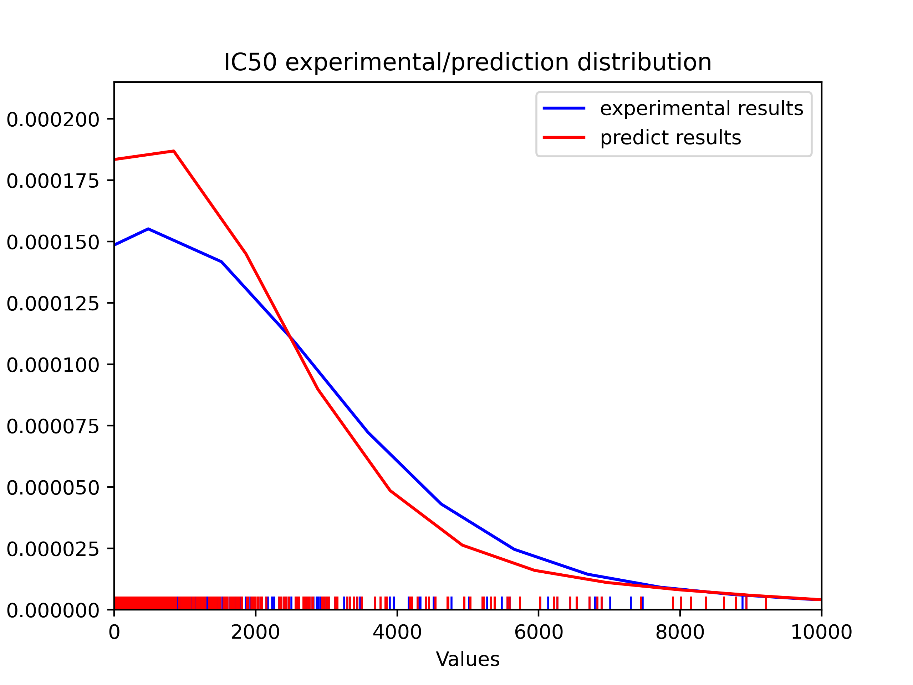
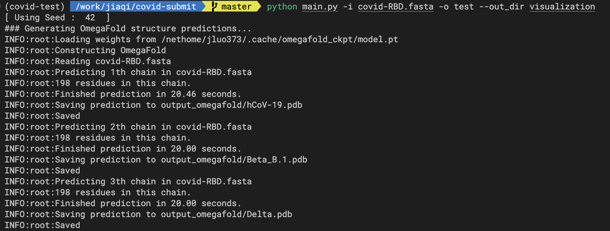
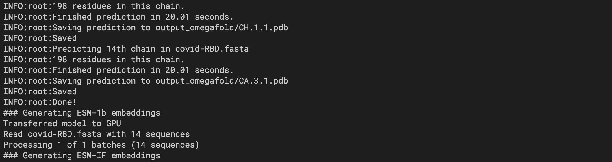
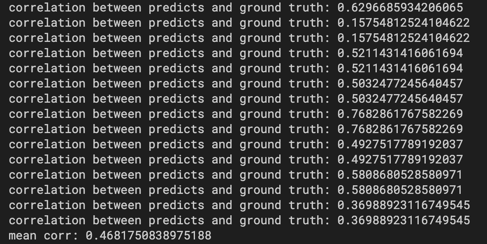

# 基于结构预测和蛋白质预训练模型的新冠变异株性质预测与可视化

### PCA可视化结果


### KNN预测血清中和IC50结果与实验结果分布

在74位病人血清中和结果上的平均相关系数：0.46

### 环境配置
创建虚拟环境
```
conda create -n covid python==3.8
conda activate covid
```
安装OmegaFold与ESM
```
pip install git+https://github.com/HeliXonProtein/OmegaFold.git
pip install fair-esm
```
下载软件源码并安装依赖
```
git clone https://github.com/luojq19/covid-pred.git && cd covid-pred
pip install -r requirements.txt
```

### 运行
- --fasta file, -i, 需要提取特征和进行可视化的序列文件，fasta格式
- --output, -o, 输出可视化图的标签
- --out_dir，输出可视化图的文件
- --seed, -s, 随机种子，默认为42，用于复现结果
- --cache，是否使用预先计算的结构和嵌入，不加--cache则会重新运行OmegaFold、ESM-1b和ESM-IF，首次运行不加--cache。
示例：
```
python main.py -i covid-RBD.fasta -o test -out_dir visualization
```

### 运行截图
OmegaFold预测结构：


ESM-1b，ESM-IF分别从序列和结构提取特征：

KNN预测结果与实验结果的相关系数以及74位病人血清中和结果的平均相关系数：
